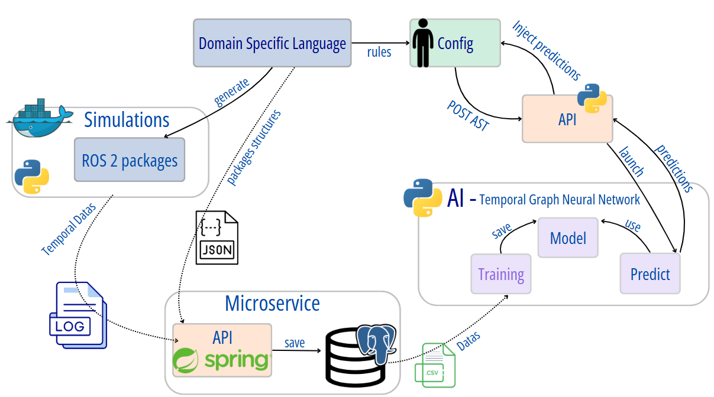

# Temporal-model-hybridization

## DSL

```bash
cd ros_aml
npm install
```
To generate the grammar, build the project and generate all ROS 2 packages based on the `.rosaml` files in `ros_configs` : 
```bash
npm run all
```
Exemple of **.rosaml** files can be found in `ros_configs` directory.

The generated ROS 2 packages will be placed in `ros2\src`.

**Alternatively, you can run each step manually :**

1. Generate the grammar & build the DSL
```bash
npm run langium:generate

npm run build
```
2. Generate all ROS2 packages from `.rosaml` config files placed in `ros_configs` directory.

```bash
npm run cli:all
```

To generate a single ROS2 package with one config file 
```bash
npm run cli ..\ros_packages\your_file.rosaml
```
## Real-Time AI Predictions for `.rosaml` files
To see predictions in real-time:
1. Launch the prediction API `ai/tgnn/tgnn_service` : see instructions in [ai/tgnn/README.md](ai/tgnn/README.md)

2. Press `F5` in a DSL typescript file in VSCode to open a new window with your extension loaded.
3. Open `.rosaml` file. Predictions should appear automatically (validations) if AI is trained


## Environment

Copy `.env.example` in `.env`.

## RUN
To build and launch all services:
```bash
docker compose up -d --build
```

## Issues

> [!Warning]
> If you have an error like this:

```sh
ERROR [test internal] load build context                                                                                                                                                                                                                                                 0.0s
 => => transferring context: 11.12kB                                                                                                                                                                                                                                                         0.0s
------
[+] Running 0/1al] load build context:
 - Service test  Building                                                                                                                                                                                                                                                                    0.8s
failed to solve: archive/tar: unknown file mode ?rwxr-xr-x
```

Delete Logs directory before restarting the build.


## Architecture



[Example of configs file (.rosaml)](ros_configs/example0.rosaml)

[Domain Specific Language](ros_aml/README.MD)

[ROS 2 packages](ros2/README.md)

[Spring API (microservice)](temporal_time_series_ms/README.md)

[AI utilization](ai/tgnn/README.md)

[Python API for predictions (tgnn_service)](ai/tgnn/README.md)

