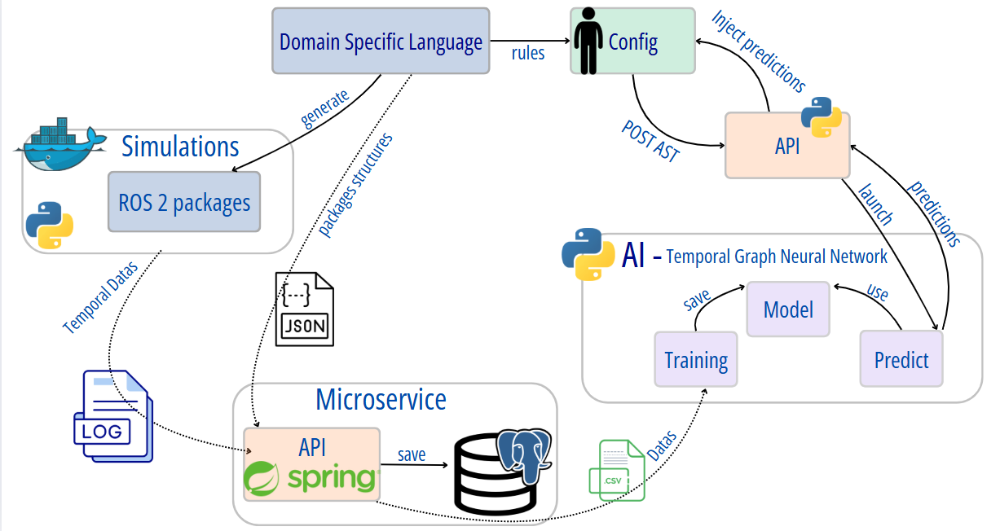

# Temporal-model-hybridization

##  DSL

```bash
cd ros_aml
npm install
```
Generate grammar & build & generate all ROS2 packages accordinf to `ros_config` `.rosaml` files
```bash
npm run all 
```
Exemple of **.rosaml** files can be found in `ros_configs`

Generated packages will be generated in `ros2\src`

**OR :**

1. To generate ast & build the DSL
```bash
npm run langium:generate

npm run build
```
2. To generate all `.rosaml` config files from `ros_configs`

```bash
npm run cli:all
```

To generate one file 
```bash
npm run cli ..\ros_packages\your_file.rosaml
```
### See the predictions in real time for a .rosaml file
Launch API `ai/tgnn/tgnn_service` : [described in ai/tgnn/README.md](ai/tgnn/README.md)

Press `F5` to open a new window with your extension loaded.
Open `.rosaml` file 


## Environment

Copy `.env.example` in `.env`.

## RUN

```bash
docker compose up -d --build
```

## Issues

> [!Warning]
> If you have an error like this:

```sh
ERROR [test internal] load build context                                                                                                                                                                                                                                                 0.0s
 => => transferring context: 11.12kB                                                                                                                                                                                                                                                         0.0s
------
[+] Running 0/1al] load build context:
 - Service test  Building                                                                                                                                                                                                                                                                    0.8s
failed to solve: archive/tar: unknown file mode ?rwxr-xr-x
```

Delete Logs.


## Architecture




[AI utilization](ai/tgnn/README.md)
