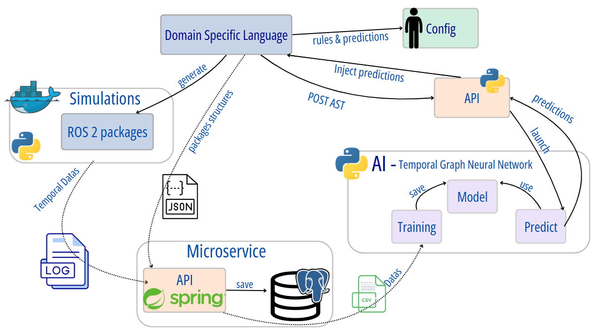

# Temporal-model-hybridization

The project aims to explore the hybridization of deductive models (derived from human knowledge) and inductive models (derived from automatic analysis of collected data) in the context of cyber-physical systems (CPS), with a particular focus on temporal aspects, taking into account their uncertainty.

We focus on temporal behaviors in ROS 2, a middleware used in cyber-physical systems such as software-defined vehicles. This middleware makes it difficult to predict runtime behavior, creating a gap between the specifications defined by the developer and the behavior observed at runtime.

The aim of this PIR is therefore to develop a better understanding of the interactions between the specification of temporal behaviors and the actual execution of embedded systems in a dynamic and uncertain environment.

A dedicated language (DSL) will be used to express the expected temporal behaviors, as well as the various ROS2 components and their configurations (definition of behavioral drift) to be generated.

For the inductive part, we need to collect data that would be as reliable as possible by running different ROS2 configurations (simulations). This data will then be used for statistical analysis and to train an AI model.

The temporal features extracted should be informative and fed back into the DSL, to provide the user with predictions on the temporal execution behavior of ROS 2 elements.

## DSL

```bash
cd ros_aml
npm install
```

To generate the grammar, build the project and generate all ROS 2 packages based on the `.rosaml` files in `ros_configs` :

```bash
npm run all
```

Exemple of **.rosaml** files can be found in `ros_configs` directory.

The generated ROS 2 packages will be placed in `ros2\src`.

**Alternatively, you can run each step manually :**

1. Generate the grammar & build the DSL

```bash
npm run langium:generate

npm run build
```

2. a. Generate **all ROS2 packages** from `.rosaml` config files placed in `ros_configs` directory.

```bash
npm run cli:all
```

2. b. Generate a **single ROS2 package** with one `.rosaml` config file

```bash
npm run cli ..\ros_configs\your_file.rosaml
```

## Real-Time AI Predictions for `.rosaml` files

To see predictions in real-time:

1. Launch the prediction API `ai/tgnn/tgnn_service` : see instructions in [ai/tgnn/README.md](ai/tgnn/README.md)

2. Press `F5` in a DSL typescript file in VSCode to open a new window with your extension loaded.
3. Open `.rosaml` file. Predictions should appear automatically (validations) if AI is trained

## Environment

Copy `.env.example` in `.env`.

## RUN

To build and launch all services:

```bash
docker compose up -d --build
```

## Issues

> [!Warning]
> If you have an error like this:

```sh
ERROR [test internal] load build context                                                                                                                                                                                                                                                 0.0s
 => => transferring context: 11.12kB                                                                                                                                                                                                                                                         0.0s
------
[+] Running 0/1al] load build context:
 - Service test  Building                                                                                                                                                                                                                                                                    0.8s
failed to solve: archive/tar: unknown file mode ?rwxr-xr-x
```

Delete Logs directory before restarting the build.

## Architecture



[Example of configs file (.rosaml)](ros_configs/example0.rosaml)

[Domain Specific Language](ros_aml/README.MD)

[ROS 2 packages](ros2/README.md)

[Spring API (microservice)](temporal_time_series_ms/README.md)

[AI utilization](ai/tgnn/README.md)

[Python API for predictions (tgnn_service)](ai/tgnn/README.md)

## Feedback

[Project limitations](docs/reports/limitations.md)

[List of Improvements](docs/reports/improvements.md)
