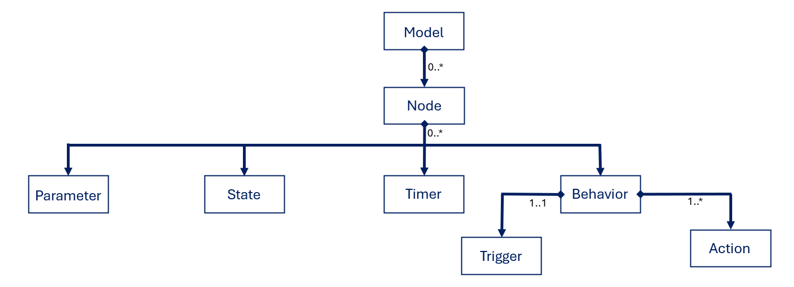

# ROSAML
## Description
RosAml is a **domain specific language (DSL)** to express the expected temporal behaviors as well as the various ROS 2 componentsand their configurations to be generated.

## Grammar

The `RosAml` grammar allows to define:
- System configuration (systemName, logging level [Add `training` to generate logs for simulations], loop settings)
- ROS 2 nodes with : 
    - Parameters 
    - States
    - Timer 
    - Behavior (when < trigger > do < actions+ >)
    - Expected execution time per node
- Triggers of behavior : Message received, timer elapsed, service request, parameter change, etc.
- Actions that node can take: Message publication, logging, service call, parameter or state update, action goal sending
- Temporal constraints such as : deadlines, jitter ... are not implemented in the generation or else but it could be used for monitoring for exemple
- Predicted execution times (added by AI prediction engine : `tgnn_service`)

## Generator
Parses the RosAml model from `.rosaml` config files.

Generates ROS 2 package(s) for each `.rosaml` with generated Python code for _subscibers_, _publishers_, _services_ and _actions_

Implements timing behavior with `rclpy` timers from `ROS 2`

Generate Docker configurations (`Dockerfile` and partial `docker-compose.yml`for deployment)

Generate launch file `launch.py` to execute all nodes together.

Generate the graph in a `JSON` formats, from the model described in `.rosaml` files, for the simulations

## Validations
Inspects the parsed AST to provide feedback on AI-based timing predictions.

These predictions are shown in the editor when the extension is loaded (press `F5`)

## AI integration: prediction flow

Each time a `.rosaml` file is modified (significantly : compared to the precedent hash) and validated :
1. The AST is parsed and transformed into a tabular format
2. The data is hashed to avoid redundant API calls
3. If changes are detected, the tabular form is sent to `tgnn_service` via POST request
4. The response contains a list of predicted times from the AI.
5. These predictions are then :
    - Re_injected directly into the AST memory (`predictedTime` attributes on triggers/actions)
    - used to display feedback messages to the user in the editor